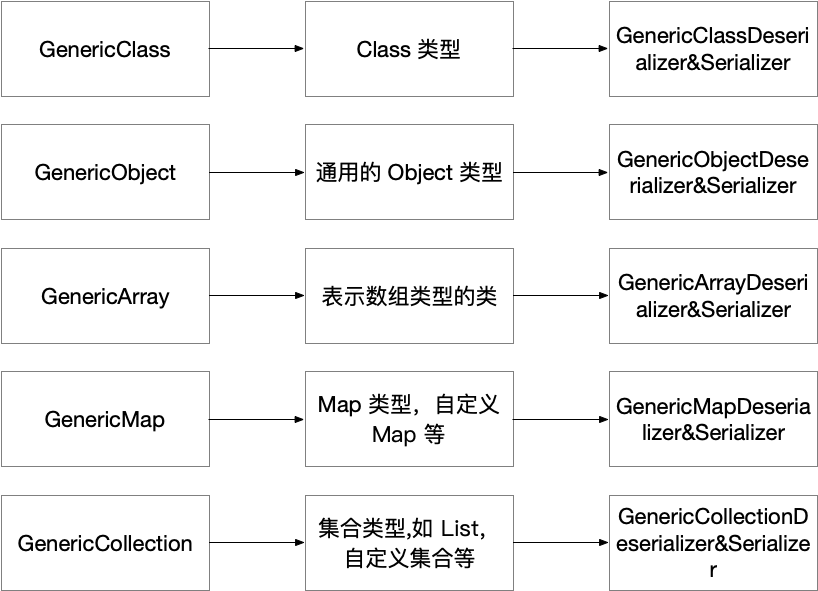

## 前言

首先，本文不会分析SOFA调用模式的源码。
其次，本文主要是为了帮助大家在实际项目开发中快速上手，理解在何种场景或情况下应该使用何种SOFA调用方式。
最后，本文所讲解的内容都是实际项目中遇到的场景，希望通过图文并茂的方式帮助到大家。如有疑问可以留言！

## 实际应用

SOFARPC 提供了多种调用方式满足不同的场景。
例如，同步阻塞调用；异步 future 调用，Callback 回调调用，Oneway 调用。
但是，本文主要讲解，SOFA直连调用和SOFA泛化调用两种模式。

### SOFA直连调用

1.**场景描述**
本次项目实际开发过程中遇到了这样的情况，SOFA注册中心虽然已经搭建完成，但是因为某些原因导致SOFA注册中心并不能正常使用。而甲方也明确表态不让使用第三方zookeeper、Consul 等注册中心。那么这时候系统之间的SOFA服务想要测试或使用我们可以采用SOFA直连方式。
2.**如何使用**
使用RPC API调用，具体使用如下：

-SOFA服务端-接口定义类(实现类代码就不贴了)


```java
import com.demo.sofa.bean.req.SxbSofaRequest;
import com.demo.sofa.bean.res.SxbSofaResponse;

public interface SxbSofaService {
    /**
     * sofa服务接口Demo
     * 
     * @param SxbSofaRequest(sofa入参javabean)
     * @return
     */
    public SxbSofaResponse sxbSofaTest(SxbSofaRequest sxbSofaRequest);
}
```

-SOFA服务端-发布服务


```xml
<beans xmlns="http://www.springframework.org/schema/beans"
    xmlns:xsi="http://www.w3.org/2001/XMLSchema-instance"
    xmlns:sofa="http://schema.alipay.com/sofa/schema/slite"
    xmlns:context="http://www.springframework.org/schema/context"
    xsi:schemaLocation="http://www.springframework.org/schema/beans
        http://www.springframework.org/schema/beans/spring-beans-3.0.xsd
        http://schema.alipay.com/sofa/schema/slite http://schema.alipay.com/sofa/slite.xsd http://www.springframework.org/schema/context http://www.springframework.org/schema/context/spring-context.xsd">

    <!-- 声明服务的实现对象 -->
    <bean id="sxbSofaService"
        class="com.demo.sofa.service.impl.SxbSofaServiceImpl" />

    <sofa:service ref="sxbSofaService"
        interface="com.demo.sofa.service.SxbSofaService">
        <sofa:binding.bolt />
    </sofa:service>
</beans>
```

-SOFA客户端-SOFA直连调用DEMO


```jsx
package com.demo.junit;

import java.util.Map;
import com.alibaba.fastjson.JSON;
import com.alibaba.fastjson.JSONObject;
import com.alipay.hessian.generic.model.GenericObject;
import com.alipay.sofa.rpc.api.GenericService;
import com.alipay.sofa.rpc.config.ConsumerConfig;
import com.uisftech.bip.util.GenericObjectUtil;

public class Test0 {
    public static void main(String[] args) {
        String sofaUrl = "bolt://IP:12200";// sofa服务提供者-sofa直连地址,12200默认端口
        String requestClassName = "com.demo.sofa.bean.req.SxbSofaRequest"; // sofa服务提供者-sofa接口入参bean
        String className = "com.demo.sofa.service.SxbSofaService";// sofa服务提供者-接口类路径
        String methodName = "sxbSofaTest";// sofa服务提供者-接口方法名
        GenericObject genericObject = null;
        Object responseObj = null;// 返回对象

        //使用JSON格式数据模拟SxbSofaRequest对象结构数据
        String requestJsonStr = "{\"SERVICE\":{\"APP_HEAD\":{\"APP_SEQ_NAME\":\"引用标签\"},\"SYS_HEAD\":{\"SYS_ID\":\"1001\",\"VER\":\"1.0.0\",\"TRAN_TIME\":\"213502913\",\"SERVICE_CODE\":\"TEST_ESB_SXB\",\"SYS_SEQ_NUM\":\"SYS33A02201810269434d\",\"INF_TYPE\":\"02\",\"USER_ID\":\"U_A01\",\"PRD_CODE\":\"PRO001\",\"INF_SEQ_NUM\":\"BIP20190624000140017\",\"RET_MSG\":\"成功\",\"BACK_TIME\":\"213502966\",\"ORIGIN_SYS_ID\":\"SYS_0001\",\"BATCH_ID\":\"800101\",\"BACK_DATE\":\"20181026\",\"GLOB_SEQ_NUM\":\"33A02201810269434dfa0\",\"RET_CODE\":\"00000\",\"SERVICE_SCENE\":\"产品净值信息接口\",\"TRAN_MODE\":\"ASYNC\",\"BACK_SEQ_NUM\":\"B02201810269434e021\",\"ACCT_DATE\":\"20181026\",\"TRAN_DATE\":\"20181026\",\"BRANCH_ID\":\"JG001\",\"TELLER_ID\":\"900108\",\"TRAN_CODE\":\"JY001\"},\"BODY\":{\"RES_APP_STATUS\":\"success\",\"RES_CODE\":\"987654321\",\"RES_APP_NAME\":\"SOFA应用\",\"RES_APP_ID\":\"A0007\",\"RES_MSG\":\"ok\",\"RES_TELLER_ID\":\"123456\",\"RES_TRANDATE\":\"20181027\"}}}";
        JSONObject requestJson = (JSONObject) JSON.parse(requestJsonStr);
        if (requestJson != null) {
            genericObject = GenericObjectUtil.buildGenericObject(requestClassName,
                    JSON.parseObject(requestJson.toJSONString(), Map.class));
        }
        // 引用一个服务
        ConsumerConfig<GenericService> consumerConfig = new ConsumerConfig<GenericService>().setInterfaceId(className)
                .setGeneric(true).setDirectUrl(sofaUrl);
        // 拿到代理类
        GenericService genericService = consumerConfig.refer();
        System.out.println("sofa代理类genericService=" + genericService);
        // 发起调用
        responseObj = genericService.$genericInvoke(methodName, new String[] { requestClassName },
                new Object[] { genericObject });
        responseObj = com.uisftech.bip.util.GenericObjectUtil.convertToObject(responseObj);
        System.out.println("sofa调用返回responseObj=" + responseObj);
    }
}
```

说明：通过 setGeneric 设置该服务为泛化服务，设置服务方的接口名。以 GenericService 作为泛化服务，通过 GenericService 就能够发起泛化调用了。这种是直连方式+泛化。

### SOFA泛化调用

1.**场景描述**
通常 RPC 调用需要客户端使用服务端提供的接口，而具体的形式则是使用 jar 包，通过引用 jar 包获取接口的的具体信息，例如接口名称，方法名称，参数类型，返回值类型。
但也存在一些情况，例如客户端没有 jar 包，或者是跨语言的调用，这个时候，就需要客户端使用字符串进行泛化调用。还有一种情况就是引用jar方式会使项目管理增加困难。
2.**如何使用**
-SOFA服务端-接口定义类(实现类代码就不贴了)


```java
import com.demo.sofa.bean.req.SxbSofaRequest;
import com.demo.sofa.bean.res.SxbSofaResponse;

public interface SxbSofaService {
    /**
     * sofa服务接口Demo
     * 
     * @param SxbSofaRequest(sofa入参javabean)
     * @return
     */
    public SxbSofaResponse sxbSofaTest(SxbSofaRequest sxbSofaRequest);
}
```

-SOFA服务端-发布服务


```xml
<beans xmlns="http://www.springframework.org/schema/beans"
    xmlns:xsi="http://www.w3.org/2001/XMLSchema-instance"
    xmlns:sofa="http://schema.alipay.com/sofa/schema/slite"
    xmlns:context="http://www.springframework.org/schema/context"
    xsi:schemaLocation="http://www.springframework.org/schema/beans
        http://www.springframework.org/schema/beans/spring-beans-3.0.xsd
        http://schema.alipay.com/sofa/schema/slite http://schema.alipay.com/sofa/slite.xsd http://www.springframework.org/schema/context http://www.springframework.org/schema/context/spring-context.xsd">

    <!-- 声明服务的实现对象 -->
    <bean id="sxbSofaService"
        class="com.demo.sofa.service.impl.SxbSofaServiceImpl" />

    <sofa:service ref="sxbSofaService"
        interface="com.demo.sofa.service.SxbSofaService">
        <sofa:binding.bolt />
    </sofa:service>
</beans>
```

-SOFA客户端-引用服务


```xml
<?xml version="1.0" encoding="UTF-8"?>
<beans xmlns="http://www.springframework.org/schema/beans"
    xmlns:xsi="http://www.w3.org/2001/XMLSchema-instance"
    xmlns:sofa="http://schema.alipay.com/sofa/schema/slite"
    xsi:schemaLocation="http://www.springframework.org/schema/beans http://www.springframework.org/schema/beans/spring-beans.xsd
            http://schema.alipay.com/sofa/schema/slite http://schema.alipay.com/sofa/slite.xsd">

    <sofa:reference id="sxbSofaService"
        interface="com.alipay.sofa.rpc.api.GenericService">
        <sofa:binding.bolt>
            <sofa:global-attrs
                generic-interface="com.demo.sofa.service.SxbSofaService" />
        </sofa:binding.bolt>
    </sofa:reference>
</beans>
```

说明：
interface：以GenericService作为泛化服务，通过GenericService能够发起泛化调用。发起调用时需要传入方法名、方法类型、方法参数。
generic-interface：指定sofa实际接口路径。

-SOFA客户端-SOFA泛化调用DEMO


```jsx
String sofaBeanId = "sxbSofaService";// 服务引用的ID
//使用JSON格式数据模拟SxbSofaRequest对象结构数据
String requestJsonStr = "{\"SERVICE\":{\"APP_HEAD\":{\"APP_SEQ_NAME\":\"引用标签\"},\"SYS_HEAD\":{\"SYS_ID\":\"1001\",\"VER\":\"1.0.0\",\"TRAN_TIME\":\"213502913\",\"SERVICE_CODE\":\"TEST_ESB_SXB\",\"SYS_SEQ_NUM\":\"SYS33A02201810269434d\",\"INF_TYPE\":\"02\",\"USER_ID\":\"U_A01\",\"PRD_CODE\":\"PRO001\",\"INF_SEQ_NUM\":\"BIP20190624000140017\",\"RET_MSG\":\"成功\",\"BACK_TIME\":\"213502966\",\"ORIGIN_SYS_ID\":\"SYS_0001\",\"BATCH_ID\":\"800101\",\"BACK_DATE\":\"20181026\",\"GLOB_SEQ_NUM\":\"33A02201810269434dfa0\",\"RET_CODE\":\"00000\",\"SERVICE_SCENE\":\"产品净值信息接口\",\"TRAN_MODE\":\"ASYNC\",\"BACK_SEQ_NUM\":\"B02201810269434e021\",\"ACCT_DATE\":\"20181026\",\"TRAN_DATE\":\"20181026\",\"BRANCH_ID\":\"JG001\",\"TELLER_ID\":\"900108\",\"TRAN_CODE\":\"JY001\"},\"BODY\":{\"RES_APP_STATUS\":\"success\",\"RES_CODE\":\"987654321\",\"RES_APP_NAME\":\"SOFA应用\",\"RES_APP_ID\":\"A0007\",\"RES_MSG\":\"ok\",\"RES_TELLER_ID\":\"123456\",\"RES_TRANDATE\":\"20181027\"}}}";
JSONObject requestJson = (JSONObject) JSON.parse(requestJsonStr);
if (requestJson != null) {
    genericObject = GenericObjectUtil.buildGenericObject("com.demo.sofa.bean.req.SxbSofaRequest",JSON.parseObject(requestJson.toJSONString(), Map.class));
}
GenericService genericService = (GenericService) SpringUtils.getBean(sofaBeanId);
GenericObject genericResult = (GenericObject) genericService .$genericInvoke("sxbSofaTest",
            new String[] { "com.demo.sofa.bean.req.SxbSofaRequest" },
            new Object[] { genericObject });
```

说明：因为我的工程是springboot启动，所以可以通过spring工厂得到引用服务xml配置文件的bean对象。下面，我把用到的工具类代码也贴出来。

#### 工具类


```dart
package com..util;

import java.lang.reflect.Array;
import java.util.Collection;
import java.util.HashMap;
import java.util.IdentityHashMap;
import java.util.Iterator;
import java.util.Map;
import java.util.Map.Entry;

import com.alipay.hessian.generic.exception.ConvertException;
import com.alipay.hessian.generic.model.GenericArray;
import com.alipay.hessian.generic.model.GenericClass;
import com.alipay.hessian.generic.model.GenericCollection;
import com.alipay.hessian.generic.model.GenericMap;
import com.alipay.hessian.generic.model.GenericObject;

/**
 * SOFA泛化返回对象转换工具
 * 
 * @author jackhang
 *
 */
public class GenericObjectUtil {
    /**
     * 将 GenericObject 转换为具体对象
     *
     * @param genericObject
     *            待转换的GenericObject
     * @return 转换后结果
     */
    @SuppressWarnings("unchecked")
    public static <T> T convertToObject(Object genericObject) {

        try {
            return (T) innerToConvertObject(genericObject, new IdentityHashMap<Object, Object>());
        } catch (Throwable t) {
            throw new ConvertException(t);
        }
    }

    private static Object innerToConvertObject(Object value, Map<Object, Object> map) throws Exception {

        // 判null
        if (value == null) {
            return null;
        }

        // 值为GenericObject类型
        if (value.getClass() == GenericObject.class) {
            GenericObject genericObject = (GenericObject) value;
            return doConvertToObject(genericObject, map);
        }

        // 值为GenericCollection类型
        if (value.getClass() == GenericCollection.class) {
            GenericCollection collection = (GenericCollection) value;
            return doConvertToCollection(collection, map);
        }

        // 值为GenericMap类型
        if (value.getClass() == GenericMap.class) {
            GenericMap genericMap = (GenericMap) value;
            return doConvertToMap(genericMap, map);
        }

        // 值为GenericArray类型
        if (value.getClass() == GenericArray.class) {
            GenericArray genericArray = (GenericArray) value;
            return doConvertToArray(genericArray, map);
        }

        // 值为GenericClass类型
        if (value.getClass() == GenericClass.class) {
            GenericClass genericClass = (GenericClass) value;
            return doConvertToClass(genericClass, map);
        }

        // 说明是jdk类, 处理集合类,将集合类中结果转换
        Object obj = handleCollectionOrMapToObject(value, map);
        return obj;
    }

    @SuppressWarnings({ "rawtypes", "unchecked" })
    private static Object handleCollectionOrMapToObject(Object value, Map<Object, Object> map) throws Exception {

        // 1. 判null
        if (value == null) {
            return null;
        }

        // 2. 查看缓存的转换记录是否存在转换历史
        if (map.get(value) != null) {
            return map.get(value);
        }

        // 3. 处理Collection实现类情况
        if (Collection.class.isAssignableFrom(value.getClass())) {

            Collection values = (Collection) value;
            Collection result = (Collection) value.getClass().newInstance();
            map.put(value, result);

            for (Object obj : values) {
                result.add(innerToConvertObject(obj, map));
            }

            return result;
        }

        // 4. 处理Map实现类情况
        if (Map.class.isAssignableFrom(value.getClass())) {

            Map<Object, Object> valueMap = (Map<Object, Object>) value;
            Map result = (Map) value.getClass().newInstance();
            map.put(value, result);

            Iterator iter = valueMap.entrySet().iterator();
            while (iter.hasNext()) {
                Map.Entry entry = (Map.Entry) iter.next();
                result.put(innerToConvertObject(entry.getKey(), map), innerToConvertObject(entry.getValue(), map));
            }

            return result;
        }

        return value;
    }

    private static Object doConvertToObject(GenericObject genericObject, Map<Object, Object> map) throws Exception {

        if (genericObject == null) {
            return genericObject;
        }
        Map<String, Object> result = new HashMap<String, Object>();

        // 如果map中缓存转换结果,直接返回
        Object object = map.get(genericObject);
        if (object != null) {
            return object;
        }

        for (Entry<String, Object> entry : genericObject.getFields().entrySet()) {
            result.put(entry.getKey(), convertToObject(entry.getValue()));
        }

        return result;
    }

    private static Class<? extends Object> loadClassFromTCCL(String clazzName) throws ClassNotFoundException {
        return Class.forName(clazzName, true, Thread.currentThread().getContextClassLoader());
    }

    @SuppressWarnings({ "rawtypes", "unchecked" })
    private static Object doConvertToCollection(GenericCollection genericCollection, Map<Object, Object> map)
            throws Exception {

        // 如果map中缓存转换结果,直接返回
        Object object = map.get(genericCollection);
        if (object != null) {
            return object;
        }

        // 检测 GenericCollection 是否封装 Collection 实例
        Class clazz = loadClassFromTCCL(genericCollection.getType());
        if (!Collection.class.isAssignableFrom(clazz)) {
            throw new IllegalArgumentException("GenericCollection实例未封装Collection实例.");
        }

        // 初始化Collection对象,并放入map
        Collection result = (Collection) clazz.newInstance();
        map.put(genericCollection, result);

        // 填充Collection对象
        Collection values = genericCollection.getCollection();
        for (Object value : values) {
            result.add(innerToConvertObject(value, map));
        }

        return result;
    }

    @SuppressWarnings({ "unchecked", "rawtypes" })
    private static Object doConvertToMap(GenericMap genericMap, Map<Object, Object> map) throws Exception {

        // 如果map中缓存转换结果,直接返回
        Object object = map.get(genericMap);
        if (object != null) {
            return object;
        }

        // 检测 GenericMap 是否封装 Map 实例
        Class clazz = loadClassFromTCCL(genericMap.getType());
        if (!Map.class.isAssignableFrom(clazz)) {
            throw new IllegalArgumentException("GenericMap实例未封装Map实例.");
        }

        // 初始化对象,并放入map
        Map result = (Map) clazz.newInstance();
        map.put(genericMap, result);

        // 填充map对象
        Iterator iter = genericMap.getMap().entrySet().iterator();
        while (iter.hasNext()) {
            Map.Entry entry = (Map.Entry) iter.next();
            result.put(innerToConvertObject(entry.getKey(), map), innerToConvertObject(entry.getValue(), map));
        }

        return result;
    }

    @SuppressWarnings("rawtypes")
    private static Object doConvertToArray(GenericArray genericArray, Map<Object, Object> map) throws Exception {

        // 如果map中缓存转换结果,直接返回
        Object object = map.get(genericArray);
        if (object != null) {
            return object;
        }

        // 初始化数组对象,并放入map
        Class clazz = loadClassFromTCCL(genericArray.getComponentType());
        Object[] objects = genericArray.getObjects();
        Object result = Array.newInstance(clazz, objects.length);
        map.put(genericArray, result);

        // 填充数组对象
        for (int i = 0; i < objects.length; i++) {
            Array.set(result, i, innerToConvertObject(objects[i], map));
        }

        return result;
    }

    private static Object doConvertToClass(GenericClass genericClass, Map<Object, Object> map)
            throws ClassNotFoundException {
        // 如果map中缓存转换结果,直接返回
        Object object = map.get(genericClass);
        if (object != null) {
            return object;
        }

        Object obj = loadClassFromTCCL(genericClass.getClazzName());
        map.put(genericClass, obj);
        return obj;
    }

    @SuppressWarnings("rawtypes")
    public static GenericObject buildGenericObject(String className, Map data) {
        GenericObject object = new GenericObject(className);
        Iterator iterator = data.entrySet().iterator();
        while (iterator.hasNext()) {
            Map.Entry entry = (Entry) iterator.next();
            object.putField((String) entry.getKey(), entry.getValue());
        }
        return object;
    }
}
```


```java
package com..util;

import org.springframework.beans.BeansException;
import org.springframework.context.ApplicationContext;
import org.springframework.context.ApplicationContextAware;
import org.springframework.stereotype.Component;
/**
 * spring boot 环境中普通类注入spring bean的工具类
 */
@Component
public class SpringUtils implements ApplicationContextAware {
    private static ApplicationContext applicationContext = null;

    @Override
    public void setApplicationContext(ApplicationContext arg0) throws BeansException {
        if (SpringUtils.applicationContext == null) {
            SpringUtils.applicationContext = arg0;
        }
    }

    // 获取applicationContext
    public static ApplicationContext getApplicationContext() {
        return applicationContext;
    }

    // 通过name获取 Bean.
    public static Object getBean(String name) {
        return getApplicationContext().getBean(name);
    }

    // 通过class获取Bean.
    public static <T> T getBean(Class<T> clazz) {
        return getApplicationContext().getBean(clazz);
    }

    // 通过name,以及Clazz返回指定的Bean
    public static <T> T getBean(String name, Class<T> clazz) {
        return getApplicationContext().getBean(name, clazz);
    }

}
```


## Hessian泛化实现

SOFA-Hessian 在 hessian 的包中加入了 com.alipay.hessian.generic 包，此包的作用就是处理泛化调用，重写的关键是实现或继承 SerializerFactory 类和 Serializer、Deserializer 等接口。在这里，设计了一下几个类，来描述
中对应的类型信息，同时实现这几个类的序列化和反序列化。对应关系如下




我们以 GenericObjectSerializer 为例，该序列化器重写了 writeObject 方法，该方法的作用就是将 GenericObject 对象序列化成目标对象字节流。即，拿出 GenericObject 的 type 字段和 fields 字段，组装成目标对象的字节流。

例如：
有一个类型是的 RPC 对象

```
public class TestObj {
    private String str;
    private int    num;
}
```

在泛化调用客户端，可以直接构造一个 GenericObject对象

```
  GenericObject genericObject = new GenericObject(
                    "com.alipay.sofa.rpc.invoke.generic.TestObj");
                genericObject.putField("str", "xxxx");
                genericObject.putField("num", 222);
```

此时，GenericObjectSerializer 就可以通过这些信息，将 GenericObject 对象转成 TestObj 对象的字节流。服务提供方就可以通过普通的 hessian2 反序列化得到对象。

相比较其他 RPC 框架两端都需要对泛化进行支持，SOFARPC 显得要友好的多。也就是说，如果应用想要支持泛化，只需要升级客户端（消费者）即可，服务端（提供者）是无感知的。因为在服务端看来，收到的对象是完全一致的。你可能觉得对于复杂类型，写出这样一个构造是很困难的。SOFA-Hessian中已经提供了一个工具类

```
com.alipay.hessian.generic.util.GenericUtils
```

来辅助使用者来生成，可以直接使用。


参考文章：
1、https://www.jianshu.com/p/5da5ef66bdc4
2、https://developer.aliyun.com/article/665642