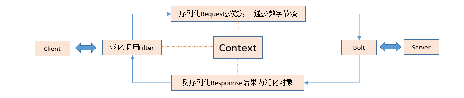
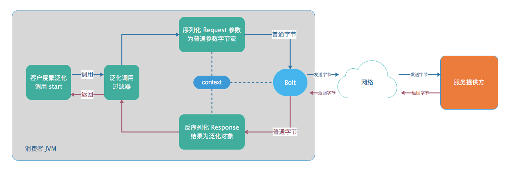
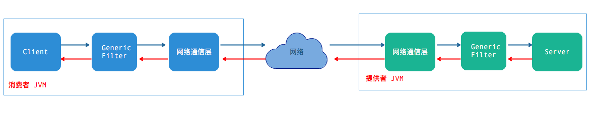

## SOFARPC —— Generic Service （泛化调用）解析

#### 一、前言

普遍RPC在客户端需要提供接口，如果不提供则无法进行调用。同时，因为客户端也依赖提供的接口，服务端的升级、优化所带来的更新，客户端也要及时的更新API，否则会带来影响。这样，就带来了依赖接口，常常更新API（接口）的麻烦。为了解决这个问题，需要进行泛化调用。

#### 二、使用

在网上一搜，都是Dubbo的泛化调用的例子，可以很少有讲解它的原理的。也不能为了用个泛化调用，就一定要使用Dubbo吧（个人观点：淘宝内部放弃Dubbo，此外配置繁琐，没有人维护，所以不建议使用）。适合的才是最好的，不能生搬硬套。

我google一下，后来发现sofa-rpc框架，里面有泛化调用（在此推荐大家使用sofa-rpc，具体介绍，自己google），下载源码，debug跟着走几遍，Generic Service 实现原理弄懂了。
[generic调用](https://github.com/sofastack/sofa-rpc/tree/master/example/src/test/java/com/alipay/sofa/rpc/invoke/generic)

代码可见: `com.xiaohuan.generic.GenericClient`

#### 三、原理

它的原理无非就是将泛化调用转化为普通调用，关键在于对象的表示和序列化。

看一下流程图：


首先，Client会通过动态代理创建GenericService的代理类；

然后，会经过一系列过滤链（优先级排序，默认不需要，大的优先级高）

```
ConsumerExceptionFilter     order = -20000
RpcReferenceContextFilter  order = -19500
ConsumerGenericFilter        order = -18000
ConsumerTracerFilter           order = -10000
HystrixFilter              order = 0
ConsumerInvoker           这里会进行真正的业务的调用
```

在泛化调用过滤器（ConsumerGenericFilter）中，会进行下列操作：

★设置序列化工厂类型为普通序列化（序列化反序列化均使用SofaSerializerFactory，值为0），并设置到Request参数中。

★进行调用参数（$invoke参数）的修正，变成普通的调用参数（调用方法，调用参数类型，调用参数值）

★设置调用类型

最后，使用SOFABolt协议进行进行网络调用。




我们来说一下这个图：

1. 泛化 API 调用时，会加载泛化过滤器，作用是做一些参数转换，同时设置序列化工厂类型。
2. SOFARPC 在使用 SOFABolt 进行网络调用前，会创建 context 上下文并传递给 SOFABolt，上下文中包含着序列化工厂类型信息，这个信息将决定使用何种序列化器，同时这个上下文将流转于整个调用期间。
3. 在 SOFABolt 正式发送数据之前，会将 GenericObject 对象序列化成普通对象的字节流，这样，服务提供方就不必关心是否为泛化调用，从图中可见，提供方不用对泛化调用做任何改变 —— __这是 SOFARPC 泛化区别于其他 RPC 泛化的关键__。
4. 当提供方成功接收请求后，使用普通序列化器即可反序列化数据，只需要正常调用并返回即可。
5. 当消费者的 SOFABolt 接收到响应数据后，便根据 context 的序列化类型，对返回值做反序列化，即将普通的字节流反序列化成 GenericObject 对象 —— 因为客户端有可能不知道返回值的 Class 类型。
6. 最终，泛化 API 即可得到 GenericObject 类型的返回值。


----

sofa-rpc-all-5.6.1.jar文件中，可以看到com/alipay/sofa/rpc/common/rpc-config-default.json文件，使用的默认
```
// 默认代理类
"default.proxy": "javassist",
```

javassist 对`$invoke`生成的真实方法是：
```java
public  java.lang.Object $invoke(  java.lang.String arg0 , java.lang.String[] arg1 , java.lang.Object[] arg2 ){
     Class clazz = com.alipay.sofa.rpc.api.GenericService.class;
     java.lang.reflect.Method method =  method_1;
     Class[] paramTypes = new Class[3];
     Object[] paramValues = new Object[3];
     paramValues[0] = ($w)$1;
     paramTypes[0] = java.lang.String.class;
     paramValues[1] = ($w)$2;
     paramTypes[1] = java.lang.String[].class;
     paramValues[2] = ($w)$3;
     paramTypes[2] = java.lang.Object[].class;
     com.alipay.sofa.rpc.core.request.SofaRequest request = com.alipay.sofa.rpc.message.MessageBuilder.buildSofaRequest(clazz, method, paramTypes, paramValues);
     com.alipay.sofa.rpc.core.response.SofaResponse response = proxyInvoker.invoke(request);
     if(response.isError()){
        throw new com.alipay.sofa.rpc.core.exception.SofaRpcException(com.alipay.sofa.rpc.core.exception.RpcErrorType.SERVER_UNDECLARED_ERROR, response.getErrorMsg());
     }
     Object ret = response.getAppResponse();
     if (ret instanceof Throwable) {
         throw (Throwable) ret;
     } else {
         return (java.lang.Object)ret;
     }
}
```


## SOFARPC 与 Dubbo 的泛化调用比较

下面我们来介绍下泛化调用和业界一些其他产品的比较，首先介绍一下序列化本身的一些性能和优势比较。

#### 序列化本身的比较

在 github 上，有一个专门针对 [Java 序列化进行的 benchmark](https://github.com/eishay/jvm-serializers/wiki)，可以稍微做一下参考。虽然在实际的场景中， 每个序列化的场景不同，带来的结果可能和这里的 benchmark 结果不同，但还是有参考意义，从该项目的基准测试可以看出：Json 无论是压缩比还是序列化时间，相比 hessian 等都有相当大的__劣势__。

同时，虽然 hessian 相对于 protostuff、kryo 等在性能上有一点差距，但是 hessian 反序列化无需指定类型，这个优势是非常有价值的。

#### Dubbo的泛化调用

在众多的 RPC 框架中，Dubbo 也提供了泛化调用的功能，接下来我们再来说说 Dubbo 的泛化。Dubbo 泛化和 SOFA RPC 泛化最大的不同就是：Dubbo 需要服务端也支持泛化，因此，如果想提供泛化功能，服务端也必须进行升级，这看起来可能没有 SOFA RPC 友好。

Dubbo 的泛化调用流程如下图：



可以看到，Dubbo 的服务端也需要泛化过滤器将 Map 解析成 POJO 来解析数据。


参考文章：

1、https://blog.csdn.net/anthony4515/article/details/114631789

2、https://developer.aliyun.com/article/665642